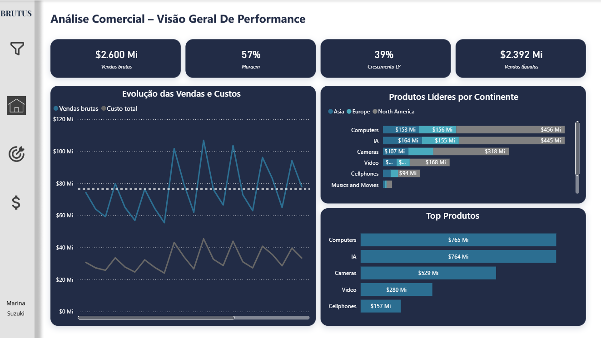
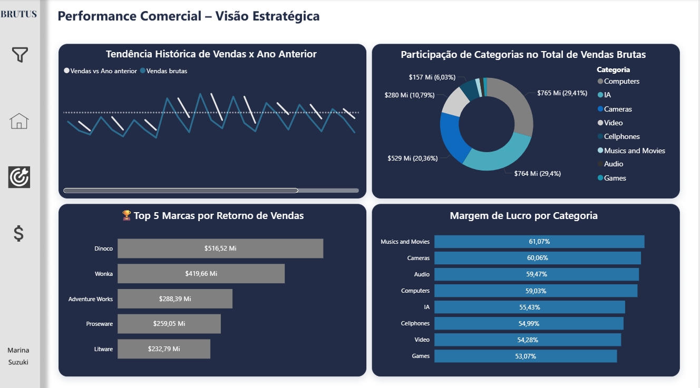
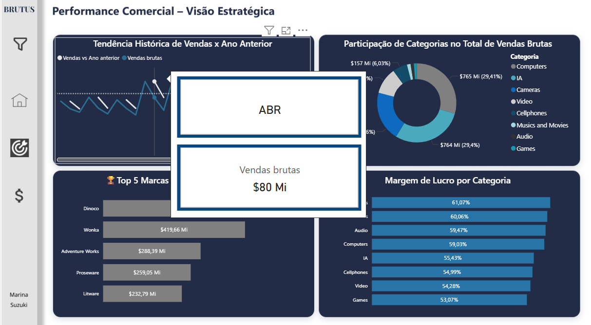
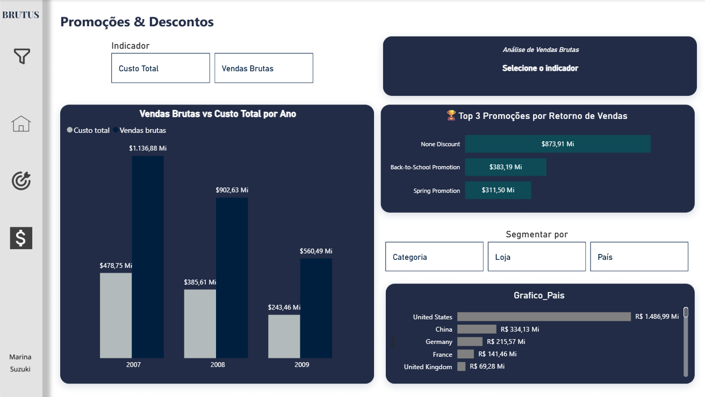

# 🎯 Dashboard Comercial – Visão Estratégica e Operacional (SharePoint + RLS)

## 🧩 Visão Geral do Projeto

Este projeto apresenta a construção de um Dashboard Comercial completo, capaz de entregar insights estratégicos sobre:

✔️ Vendas
✔️ Custos
✔️ Categorias de produtos
✔️ Continentes
✔️ Promoções & campanhas
✔️ Margens e KPIs dinâmicos

Além disso, o projeto implementa um RLS (Row-Level Security) integrado com uma tabela de usuários e SharePoint, garantindo segurança de acesso por País.

*Filtros sincronizados entre abas.*

---

*🔔 Todos os dados são fictícios e foram criados apenas para fins educacionais.*

---

### 📌 Modelagem em Snowflake Schema: 
  - Fato e Dimensões;
  - Tabelas auxiliares:
      - Selecao_Medida → troca de indicadores
      - Segmento_Visual → segmentações dinâmicas
      - 
### 📌 RLS – Segurança de Acesso

- RLS_Usuarios → mapeamento Email x País

- Implementado via:

      -[Email] = USERPRINCIPALNAME()

Conectado à tabela RLS_Usuarios
Permitindo que cada usuário visualize apenas dados do seu País autorizado.

---
## 📊 Estrutura do Dashboard

### 🌍 1. Aba Geral – Visão Geral de Performance

- KPIs estratégicos (Vendas Brutas, Margem, Crescimento LY, Vendas Líquidas);

- Tendência de vendas x custos;

- Distribuição de produtos por continente;

- Top produtos globais.

*Objetivo: visão executiva para decisões rápidas.* 

---

### 📈 2. Aba Performance – Visão Estratégica

- Análise de tendências (vendas x ano anterior);

- Participação das categorias no total de vendas brutas;

- Ranking das marcas com maior retorno;

- Margem por categoria.

  *Objetivo: identificar oportunidades e produtos estratégicos.* 
  

### 🧰 Inclui Tooltip personalizada:
→ ao passar o mouse sobre a linha, exibe: Nome do mês e Valor da venda brutas.

 

---

### 🛒 3. Aba Promoções & Descontos

- Comparação entre Custo Total vs Vendas Brutas;

- Top 3 promoções;

- Filtros por Categoria, Loja e País;
  
- Vendas vs custo total por ano;

*Objetivo: medir o impacto das campanhas promocionais e priorizar ações comerciais.*

## 📌 Segmentações Inteligentes

- Botões de alternância entre indicadores;

- Segmentação por País, Loja e Categoria;

---

## 🛠️ Ferramentas

  - Power BI Desktop – modelagem, DAX, navegação e RLS;
  - Figma – design visual do dashboard;
  - SharePoint – armazenamento e atualização automática da base.

### ⚠️ Observações

Este projeto utiliza dados fictícios, criados exclusivamente para fins de estudo e prática. Todo o material faz parte do meu portfólio analítico e não representa nenhum dado real empresarial.

